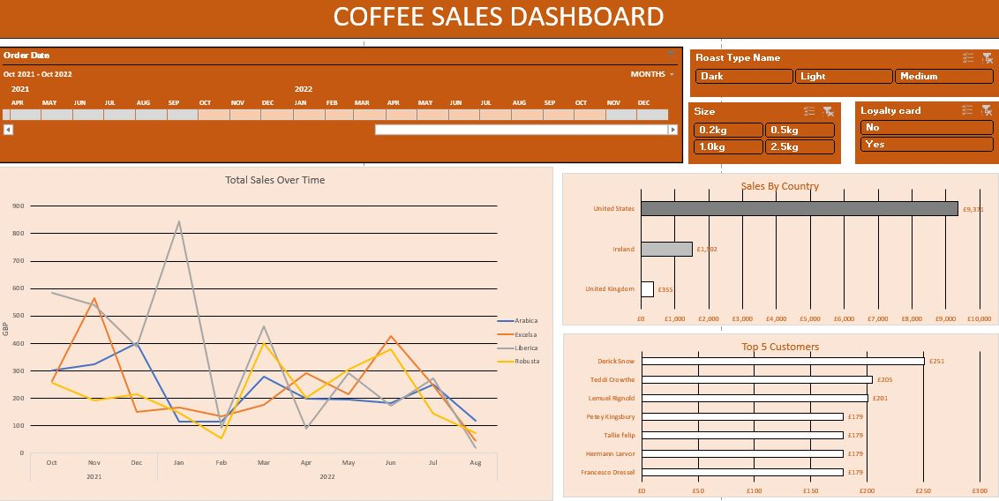
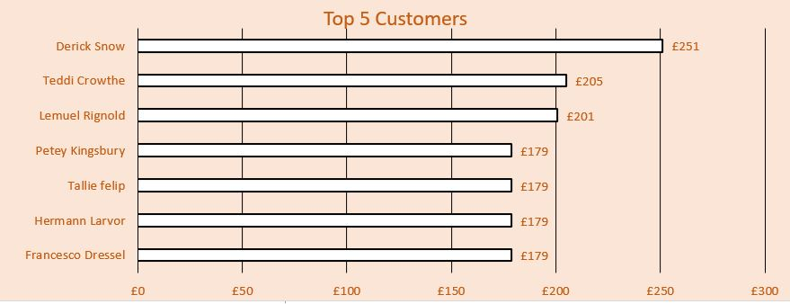

# Coffee Sales Dashboard
## Overview
An Excel-based dashboard that visualises coffee bean sales data with interactive filters, KPIs, and charts. 

Built by cleaning raw data, performing lookups, and designing pivot-table visuals to present clear business insights.

## Features
- Timeline filter: To explore sales over time by month/year

- Slicers: Filter by roast type, package size, and loyalty card

- Total Sales Over Time: A  line chart showing the popularity of different coffee types (Arabica, Excelsa, Liberica, Robusta)

- Sales by Country: A bar chart (United States, Ireland, UK)

- Top 5 Customers: A bar chart showing highest spenders

## Skills Demonstrated
- Data cleaning and organising
- Formulas
- Excel techniques
- Dashboard Design

## Dataset 

## Screenshots

### 1. Overall Dashboard

### 2. Top 5 Customers

### 3. Sales Over Time

## How to use
1. Download coffeeOdersData.xlsx from this repo
2. Open in Excel
3. Use the timeline and slicers to interact with the dashbaord

## What I learned 
- How to design a professional, intractive dashboard in Excel
- How to combine multiple tables into a clean dataset
- Creating pivot tables and charts for KPIs
